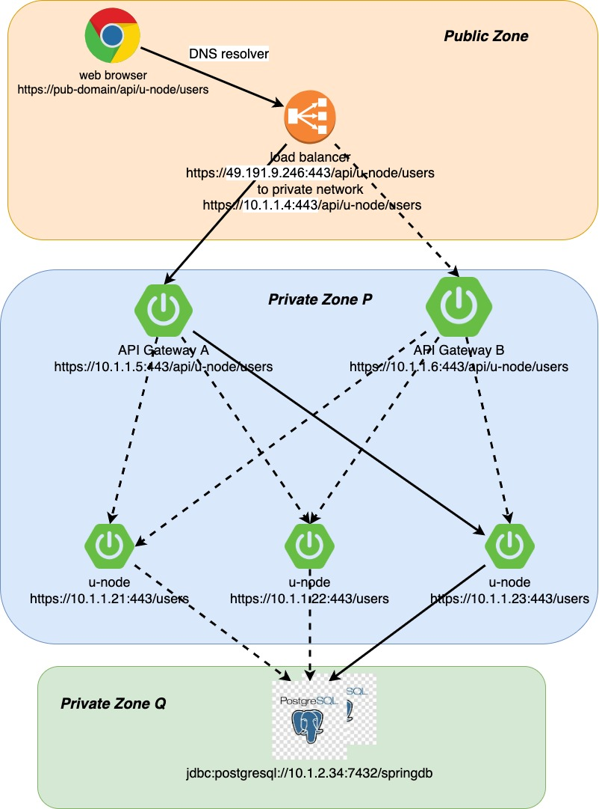

Basis Spring boot Architecture
------------------------------

The follow architecture consists of microservices such as admin,
transaction, reporting and etc. In addition, this architecture has HA
proxy (Load balancer), Eureka, API gateway (Zuul proxy) and Postgres
database. Every module communicates via https and with JSON format.

Dataflow
--------
There are three zones in the below diagram public zone (can be accessed
by public), private zone P (can be accessed by private IP 10.1.1.4) and
private zone Q (can be accessed by private IP range10.1.1. \*)

------------------------------------------------------------------------------------------------------------------------

Deployments and Versioning
--------------------------

Highly recommend using [semver](https://semver.org/) versioning
strategy, at least with two dots ex X.Y.Z

-   X- major release, means deploying completely new feature

-   Y- minor release, updating exiting feature

-   Z- patches / bugfixes

There are many tools to achieve Continuously Integration (CI) and
Continuously Deployment (CD) ex: Jenkins (preferred), Amazon Code Deploy
and etc. Can be adopted based on company requirement.

Source code maintenance and Docker Registry
-------------------------------------------

Highly recommend hosting all source code to git repository. Because it
has many good features such as stash and etc which helps to maintain
source code smoothly. Best practise in git workflow

-   Master: has the source code of production release

-   Branches:

    -   Feature development:

    -   Bugfixes

    -   Deployment: contains the source code of Bugfixes or Feature
        development (next release)

-   Tags

    -   Production release

    -   QA release

Once the release has been pushed to QA, source code has to be built and
pushed to local docker register. Code will be pulled and deployed at QA.
After verification, code will be deployed at staging and production
environment.

Above diagram staging and production environment are identical

***Note: "**[Sonarqube](https://www.sonarqube.org/) **will be used to
verify code quality" ***

Backup and Rollback 
--------------------

If everything goes smoothly, there is no requirement for backup and
rollback. Unfortunately, this code hasn't been deployed in garden of
Eden. Therefore, highly recommend having backup of database and etc
before deployment. In case of emergency, can use ***local** **docker
registry*** for rollback

Code structure
--------------

Highly recommend using build tool when starting new project. Gradle is
really good tool which has nice features. On the other hand, maven has
better dependency management. Therefore, prefer to use maven.

Figure

The above code is multi module project. Which has been derived from six
years of retrospective view on code structure. Entire project falls into
five layers which are

-   UI: contains web interface (Vue/ Angular/ React)

-   Controller: accepts all rest requests

-   Service: this layer is secured by spring has two subcomponents,

    -   Validations

    -   Business cases

-   DAO: data will be accessed via this layer, manage by JPA with
    Hibernate

-   Common: has commonly used entities, config and etc across the layers

Code highlights
---------------

During the development there few areas developer has to focus carefully
which are

-   Use proper logging

-   Maximum avoid loop inside loop

-   Use Java 8 stream feature for iteration

-   Use spring \@hasPermission in service level

-   Maintain static class for REST URI

-   Use AuditingEntityListener for JPA audit

-   Use \@JsonBackReference for many to one mapping, to avoid
    stackoverflow error

-   Use Optional class to have simplified code

Testing and Audit
-----------------

There are many test strategies have been followed while developing an
application such as Test-Driven Development (TDD) and Behaviour Driven
Development (BDD). However, each and every System Requirement
Specification (SRS) or Issues should have at least minimum two test
cases (success and failure). This can be achieved by Junit / Test NG /
Mockito and Selenium. In addition, the following sheet has to be
completed by relevant authorities to maintain the standards and Quality
of application (ex CMMI, ISO and etc).

  Version of Release   V1.2.1                                                    

Product or Technology migration
-------------------------------

In digital world, migration plays major role. Because everybody wants
high (throughput) efficient, secured, reliable and scalable application
(Yes cost also matter !!!). Before initiate migration, highly recommend
defining the scope. New technology has to satisfy the defined scope. The
following table shows technology migration in my career.

When it comes to product migration. User experience, impression and
usability play key roles in costing. The following diagram shows basic
migration strategy. Good design and implementation should reduce mt
